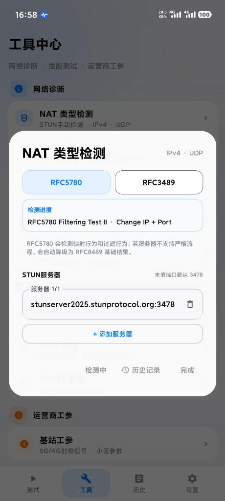
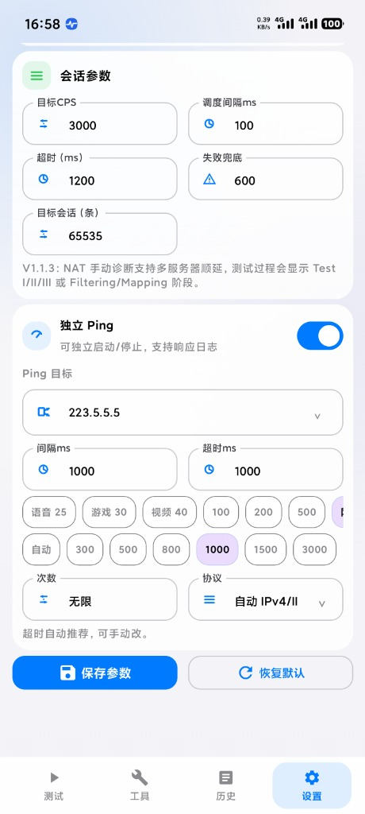

<div align="center">


# NetSessionTester

**专业级跨平台宽带会话并发压测 & 全功能网络诊断套件**  
*Broadband Session Stress Tester & Network Diagnostic Toolkit*

[](https://github.com/OnlyChallgener/NetSessionTester)
[](https://kotlinlang.org/)
[](https://www.jetbrains.com/lp/compose-multiplatform/)
[](CHANGELOG.md)
[](TEST_NOTES_current.md)
[](LICENSE)

</div>

---

## 📖 项目简介

**NetSessionTester** 是一款基于 Kotlin Multiplatform (CMP) 构建的现代化跨平台网络诊断与高性能会话压测工具。

面向网络工程师、极客玩家、宽带装维与运维技术人员，NetSessionTester 针对家庭宽带、企业网关、光猫 NAT 会话表承载极限、网络抖动、DNS 劫持、WiFi 漫游丢包以及运营商基站射频工参等复杂网络场景，提供了一站式、高精度、可视化的排查与压测方案。

应用支持直观的 4-Tab 导航体系（**测试**、**工具**、**历史**、**设置**），融合现代化设计美学，在 Android、Windows、macOS 与 iOS 上均提供原生级流畅体验。

---

## 📱 界面预览

| 宽带会话测试 & 实时 Ping | 工具中心（8大诊断矩阵） | NAT 类型深度探测 (RFC5780) | 核心参数精细调优 |
| :---: | :---: | :---: | :---: |
|  |  |  |  |
| 实时发包 / RTT折线 / 丢包色彩预警 | 网络诊断 / 性能测试 / 运营商工参 | 映射与过滤行为 / STUN 自动顺延 | CPS并发 / 调度间隔 / 场景快捷预设 |

---

## ✨ 核心功能特性

### 1. ⚡ 宽带会话与连接数压力测试 (Session & CPS Stress Test)
- **极速调度引擎**：底层目标 CPS（每秒新建连接数）调度上限支持高达 **20,000 CPS**，全面测试光猫 NAT 芯片、企业级路由器及防火墙在极速并发下的承载极限。
- **超大容量并发会话池**：单机支持测试目标高达 **65,535+** 并发长连接/短连接保持，精准排查光猫/网关会话表溢出水线、丢包、断流与假死问题。
- **动态发射窗口与在飞保护**：动态拓展在飞队列窗口（`maxPending` 达 20,000），消除高并发启动初期的阶跃锯齿；智能自适应在飞失败配额，防止瞬时低会话失败误判。
- **前台保活与优雅释放**：支持 Android Foreground Service 前台保活，息屏后台持续稳定压测；支持动画式平滑连接释放与强制清理，避免本地协议栈端口耗尽。
- **智能诊断建议**：测试完成后根据连接成功率、延迟膨胀、失败分布自动输出针对性诊断建议与瓶颈分析。

### 2. 📈 独立实时 Ping 监控与交互式折线图 (Real-time Ping Monitor)
- **独立启停运行**：无需启动压力测试即可单独运行 Ping 监控，轻量低耗，适合长时间日常网络质量监测。
- **双协议栈覆盖**：支持标准 **ICMP Ping** 与 **TCP Ping** 双协议，灵活穿透或针对指定业务端口探测握手延迟。
- **动态交互式折线图**：
  - 亚秒级高采样率，实时渲染平滑 RTT 曲线。
  - 支持**手势水平拖拽**回溯历史时间窗口采样点，**双击一秒复位**回到实时走势。
  - 动态紧凑自适应 Y 轴缩放，搭配智能吸附悬浮游标。
  - 状态色彩分级标识：🟢 正常稳定、🟠 高延迟警告、🔴 丢包故障。
- **场景化快捷预设**：提供一键切换场景胶囊（语音 25ms、游戏 30ms、视频 40ms 等），快速适配不同场景检测需求。
- **全方位指标统计**：实时统计当前 RTT、平均/最低/最高延迟、抖动（Jitter）、丢包率、瞬时与平均发包速率。

### 3. 🧰 全功能网络诊断工具箱 (Diagnostic Suite)

#### 🌐 网络诊断
- **NAT 类型检测**：严格遵循 **RFC 5780**（NAT 映射行为 Mapping Behavior 与过滤行为 Filtering Behavior 深度双向判定）与经典 **RFC 3489** 规范，支持自动降级至 RFC 8489；内置国内高可用 STUN 节点池并支持自动顺延，精准识别 Full Cone (NAT 1)、Restricted Cone (NAT 2)、Port Restricted Cone (NAT 3)、Symmetric (NAT 4) 以及 CGNAT（运营商大内网）与双层 NAT (Double NAT)。
- **NSLookup 域名解析**：支持系统默认 DNS 与自定义上游 DNS（如 AliDNS、DNSPod、Cloudflare、Google DNS）对比解析 A (IPv4) / AAAA (IPv6) 记录，秒级排查 DNS 污染、重定向与劫持。
- **Traceroute 逐跳路由追踪**：逐跳解析从本机到目标服务器路径上的网关 IP、节点跳数与往返延迟，精准定位跨省、跨网拥塞点与路由回环。
- **MTU 路径探索**：采用启发式收敛探测算法（通常 1~2 秒极速收敛），测定端到端链路 Path MTU，支持 TCP MSS 双轨交叉校验，并提供家庭路由器、PS5/Switch/PC 主机场景化优化指导。
- **IPv6 诊断**：快速校验 IPv6 连通性、本地链路地址与公网 IPv6 可路由状态。

#### 🚀 性能测试
- **Bufferbloat 缓冲膨胀评级**：测定空载基线延迟与满载排队延迟增量（Delta RTT），输出国际标准 **A+ 至 F 级**电竞级网络评级，并提供路由器 SQM (CAKE / FQ-CoDel) 队列调优建议。
- **WiFi 无缝漫游感知**：实时监听 WiFi 接入点（AP）BSSID 切换事件，精准量化 AP 漫游瞬间的丢包数、信号强度跳变与切换时延。
- **iPerf3 测速客户端**：轻量化实现原生 iPerf3 客户端握手与压测，支持局域网自建及公网服务器打流，支持 TCP / UDP 以及下行 (Reverse) 与上行双向吞吐速率测算与实时速率曲线展示。

#### 📡 运营商工参
- **基站工参看板 (5G/4G Cellular Monitor)**：实时读取移动蜂窝网络底层射频参数，包括主服务小区频段（如 5G n78/n41/n28、4G B1/B3/B5/B8 等）、物理小区识别码 (PCI)、参考信号接收功率 (RSRP)、信干噪比 (SINR)、跟踪区代码 (TAC) 及周边邻区候选基站信号，为弱网排查与基站覆盖分析提供专业数据。

### 4. 📂 历史记录沉淀与数据报表 (History & Export)
- **本地持久化存储**：压测会话、实时 Ping 走势、Bufferbloat、WiFi 漫游、iPerf3 等全部测试记录持久化保存在本地。
- **时间轴与按天折叠**：支持按天智能归档折叠，支持快速展开、单条记录左滑删除与清空。
- **CSV 格式报表导出**：一键导出标准 CSV 报表，便于网络工程取证、留存与离线深度分析。

---

## 🏛️ 支持平台与技术架构

| 平台 | 展现层 | 网络传输 / 底层支持 | 分发形式 |
| :--- | :--- | :--- | :--- |
| **Android** | Jetpack Compose + Material 3 | Kotlin Coroutines + NIO / Linux 套接字 | APK 安装包 (`:app`) |
| **Windows** | Compose Desktop (原生融合标题栏) | Java NIO 非阻塞并发套接字 | 绿色便携包 (ZIP) / 安装向导 (Inno Setup EXE) |
| **macOS** | Compose Desktop (Apple HIG 设计) | Java NIO 非阻塞套接字 + 自包含 JRE | DMG 镜像安装包 |
| **iOS** | 原生 UIKit (Liquid Glass) + Compose | POSIX 原生套接字 + 共享测量调度器 | 无签名 / 自签 IPA |

### 项目模块划分

- `:app`：Android 专属宿主应用，管理 Android Activity 生命周期、前台保活服务、Telephony 运营商基站看板及传感器。
- `:shared`：跨平台核心模块，包含：
  - `commonMain`：跨平台共享算法（CPS Pacer、Ping 统计累加器、STUN/DNS/ICMP 报文编解码）。
  - `jvmMain`：桌面端应用主界面 (`DesktopApp`)、双轴自适应图表、历史记录持久化 (`DesktopHistoryStore`) 与 NIO 压测引擎。
  - `iosMain`：iOS 内容页、POSIX 网络实现与 Objective-C 原生接口 (`NSTAppFactory`)。
  - `androidMain`：Android 端的平台互操作与 Compose 运行时支持。
- `desktop/`：桌面端打包资源（图标、Inno Setup 脚本及 iOS 启动入口）。
- `docs/validation`：静态源契约、协议报文与生命周期 Python 自动化校验集。

---

## 🛠️ 本地验证与多平台构建

### 1. 本地契约与自动化检查
无需安装完整 Gradle 或 Xcode 即可快速验证源码契约、协议编解码及生命周期安全性：
```bash
python -m unittest discover -s docs/validation -p 'test_*.py' -v
```

### 2. Android 构建
```bash
# 编译 Debug 版 APK
gradle :app:assembleDebug --no-daemon

# 编译 Release 版 APK（需配置签名环境变量）
gradle :app:assembleRelease --no-daemon
```

### 3. Windows 桌面端构建
```bash
# 生成自带私有 Java 运行时的独立绿色发布包
gradle :shared:createDistributable --no-daemon

# 生成安装向导（需安装 Inno Setup）
iscc.exe installer.iss
```

### 4. macOS 桌面端构建
```bash
# 生成自包含 macOS 原生 DMG 安装包
gradle :shared:packageDmg --no-daemon
```

### 5. iOS 跨平台框架构建
```bash
# 编译 iOS Arm64 Release Framework
gradle :shared:linkReleaseFrameworkIosArm64 --no-daemon
```

---

## 📂 发布说明与文档结构

为保证项目的版本可追溯性与结构整洁，请遵循以下规范：

- `CHANGELOG.md`：针对已发布或发布候选版本的正式变更日志。
- `TEST_NOTES_current.md`：当前构建版本（build157）的活跃验证清单。
- `docs/BUILD_HISTORY.md`：过往本地自测及发布修复构建版本的简要时间线归档。
- `docs/RELEASE_TEMPLATE.md`：用于未来发版准备的标准化模板。
- `design.md`：遵循 Apple HIG 与现代化设计语言的设计规范文档。

> [!NOTE]
> 请勿在根目录添加临时说明文件（如 `README_selftest_buildXXX.md`）。请将当前验证详情保持在 `TEST_NOTES_current.md`；当构建版本迭代时，请将旧版本记录归档至 `docs/BUILD_HISTORY.md`。

---

## 📄 开源许可证

本项目基于 [Apache License 2.0](LICENSE) 许可证分发与使用。
